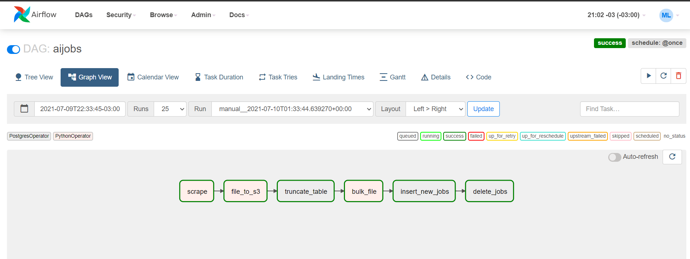

## DAG Description
The main purpose of this **Apache Airflow** DAG is to scrape data from an ai-jobs website, to save the file in an **Amazon S3 bucket**, then downloading file in **Amazon Redshift database** (Postgresql behind) and finally to process data.

## Tech
- Python
- Apache Airflow
- Pandas
- Selenium
- AWS (S3 and Redshift)
- PostgreSQL

## DAG Graph View

### Below step descriptions

> **Scrape**: this task uses selenium library and scrapes an ai-jobs site in order to take all information about jobs descriptions including:  
      > Link  
      > Title  
      > Company  
      > Work Type *(Full Time, Part Time, Contractor)*  
      > Skills required *(str[] list)*  
      > Location  

> **File_to_s3**: takes the file recently created (based on previous task) and moves it to Amazon S3 bucket.

> **Truncate table**: connects to Amazon Redshift database and truncates the temp raw table.

> **Bulk_file**: this tasks uses COPY postresql script in order to BULK csv file to public.bulk_data_jobs table.

> **Insert_new_jobs**: here the process inserts ***new*** records found on recent file on public.data_jobs table - creation_date gets CURRENT_DATE.
This table has the entire jobs history.

> **Delete_jobs**: finally, this task compares and sets delete_date on those records which were present ***yesterday***, but not present on ***today*** file.
